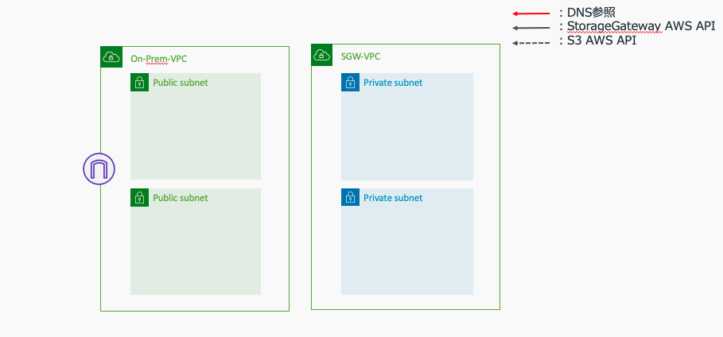
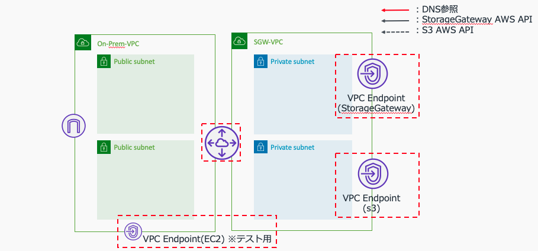
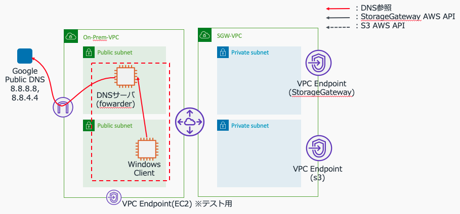
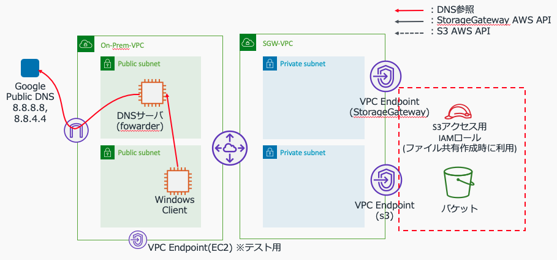
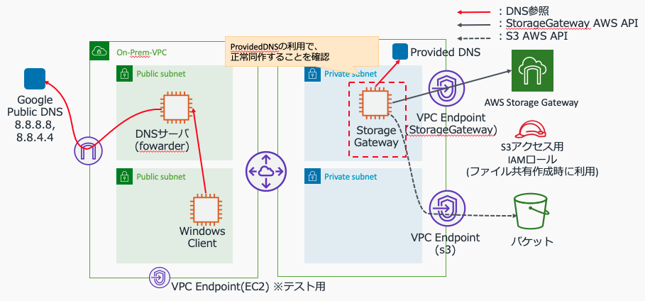
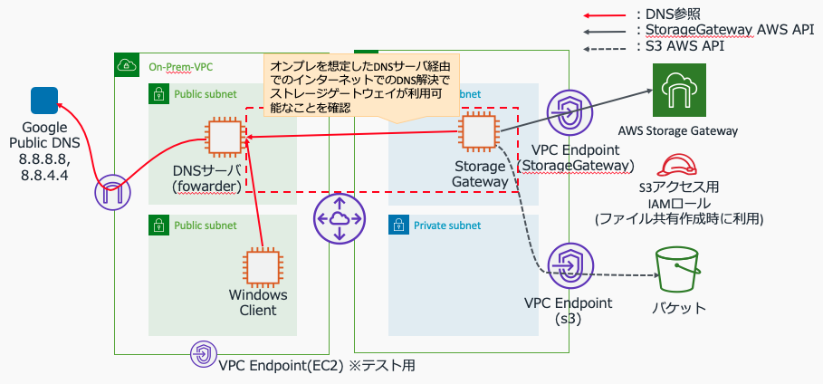

# StorageGateway検証環境
StorageGateway(ファイルゲートウェイ)の検証環境を作成するCloudFormationと手順

# 作成環境
<center></center>

# 作成手順
## (1)事前設定
### (1)-(a) 作業環境の準備
下記を準備します。
* aws-cliのセットアップ
* AdministratorAccessポリシーが付与され実行可能な、aws-cliのProfileの設定
### (1)-(b) CLI実行用の事前準備
これ以降のAWS-CLIで共通で利用するパラメータを環境変数で設定しておきます。
```shell
export PROFILE=<設定したプロファイル名称を指定。デフォルトの場合はdefaultを設定>
export REGION=ap-northeast-1
```
## (2)VPCの作成(CloudFormation利用)
IGWでインターネットアクセス可能で、パブリックアクセス可能なサブネットx3、プライベートなサブネットx3の合計6つのサブネットを所有するVPCを作成します。
<center></center>
### (2)-(a)テンプレートのダウンロード
私が作成し利用しているVPC作成用のCloudFormationテンプレートを利用します。まず、githubからテンプレートをダウンロードします。
```shell
curl -o vpc-2subnets.yaml https://raw.githubusercontent.com/Noppy/CfnCreatingVPC/master/vpc-2subnets.yaml
```
### (2)-(b)CloudFormationによるOn-Prem VPC作成
ダウンロードしたテンプレートを利用し、VPCをデプロイします。
```shell
CFN_STACK_PARAMETERS='
[
  {
    "ParameterKey": "DnsHostnames",
    "ParameterValue": "true"
  },
  {
    "ParameterKey": "DnsSupport",
    "ParameterValue": "true"
  },
  {
    "ParameterKey": "InternetAccess",
    "ParameterValue": "true"
  },
  {
    "ParameterKey": "VpcName",
    "ParameterValue": "OnPremVPC"
  },
  {
    "ParameterKey": "VpcInternalDnsName",
    "ParameterValue": "on-prem."
  },
  {
    "ParameterKey": "VpcCidr",
    "ParameterValue": "10.2.0.0/16"
  },
  {
    "ParameterKey": "Subnet1Cidr",
    "ParameterValue": "10.2.64.0/24"
  },
  {
    "ParameterKey": "Subnet2Cidr",
    "ParameterValue": "10.2.128.0/24"
  }
]'

aws --profile ${PROFILE} cloudformation create-stack \
    --stack-name SGWPoC-OnPrem-VPC \
    --template-body "file://./vpc-2subnets.yaml" \
    --parameters "${CFN_STACK_PARAMETERS}" \
    --capabilities CAPABILITY_IAM ;
```
### (2)-(c)CloudFormationによるSGW-VPC作成
ダウンロードしたテンプレートを利用し、VPCをデプロイします。
```shell
CFN_STACK_PARAMETERS='
[
  {
    "ParameterKey": "DnsHostnames",
    "ParameterValue": "true"
  },
  {
    "ParameterKey": "DnsSupport",
    "ParameterValue": "true"
  },
  {
    "ParameterKey": "InternetAccess",
    "ParameterValue": "false"
  },
  {
    "ParameterKey": "VpcName",
    "ParameterValue": "SgwVPC"
  },
  {
    "ParameterKey": "VpcInternalDnsName",
    "ParameterValue": "sgw."
  },
  {
    "ParameterKey": "VpcInternalDnsName",
    "ParameterValue": "on-prem."
  },
  {
    "ParameterKey": "VpcCidr",
    "ParameterValue": "10.1.0.0/16"
  },
  {
    "ParameterKey": "Subnet1Cidr",
    "ParameterValue": "10.1.64.0/24"
  },
  {
    "ParameterKey": "Subnet2Cidr",
    "ParameterValue": "10.1.128.0/24"
  }
]'

aws --profile ${PROFILE} cloudformation create-stack \
    --stack-name SGWPoC-Sgw-VPC \
    --template-body "file://./vpc-2subnets.yaml" \
    --parameters "${CFN_STACK_PARAMETERS}" \
    --capabilities CAPABILITY_IAM ;
```
## (3) Peering & VPCEndpoint設定
２つのVPCをPeering接続し、必要となるVPC Endpointを作成します。<br>
オンプレを措定した"On-Prem-VPC"のVPC Endpointは、DNSサーバ作成後の動作テスト用に作成するものです。
<center></center>
### (3)-(a) 構成情報取得
```shell
#構成情報取得
ONPRE_VPCID=$(aws --profile ${PROFILE} --output text \
    cloudformation describe-stacks \
        --stack-name SGWPoC-OnPrem-VPC \
        --query 'Stacks[].Outputs[?OutputKey==`VpcId`].[OutputValue]')

ONPRE_VPC_CIDR=$(aws --profile ${PROFILE} --output text \
    cloudformation describe-stacks \
        --stack-name SGWPoC-OnPrem-VPC \
        --query 'Stacks[].Outputs[?OutputKey==`VpcCidr`].[OutputValue]')

ONPRE_ROUTETABLEID=$(aws --profile ${PROFILE} --output text \
    cloudformation describe-stacks \
        --stack-name SGWPoC-OnPrem-VPC \
        --query 'Stacks[].Outputs[?OutputKey==`RouteTableId`].[OutputValue]')

ONPRE_SUBNET1=$(aws --profile ${PROFILE} --output text \
    cloudformation describe-stacks \
        --stack-name SGWPoC-OnPrem-VPC \
        --query 'Stacks[].Outputs[?OutputKey==`Subnet1Id`].[OutputValue]')

ONPRE_SUBNET2=$(aws --profile ${PROFILE} --output text \
    cloudformation describe-stacks \
        --stack-name SGWPoC-OnPrem-VPC \
        --query 'Stacks[].Outputs[?OutputKey==`Subnet2Id`].[OutputValue]')

SGW_VPCID=$(aws --profile ${PROFILE} --output text \
    cloudformation describe-stacks \
        --stack-name SGWPoC-Sgw-VPC \
        --query 'Stacks[].Outputs[?OutputKey==`VpcId`].[OutputValue]')

SGW_VPC_CIDR=$(aws --profile ${PROFILE} --output text \
    cloudformation describe-stacks \
        --stack-name SGWPoC-Sgw-VPC \
        --query 'Stacks[].Outputs[?OutputKey==`VpcCidr`].[OutputValue]')

SGW_ROUTETABLEID=$(aws --profile ${PROFILE} --output text \
    cloudformation describe-stacks \
        --stack-name SGWPoC-Sgw-VPC \
        --query 'Stacks[].Outputs[?OutputKey==`RouteTableId`].[OutputValue]')

SGW_SUBNET1=$(aws --profile ${PROFILE} --output text \
    cloudformation describe-stacks \
        --stack-name SGWPoC-Sgw-VPC \
        --query 'Stacks[].Outputs[?OutputKey==`Subnet1Id`].[OutputValue]')

SGW_SUBNET2=$(aws --profile ${PROFILE} --output text \
    cloudformation describe-stacks \
        --stack-name SGWPoC-Sgw-VPC \
        --query 'Stacks[].Outputs[?OutputKey==`Subnet2Id`].[OutputValue]')

echo $ONPRE_VPCID $ONPRE_VPC_CIDR $ONPRE_ROUTETABLEID $SGW_VPCID $SGW_VPC_CIDR $SGW_ROUTETABLEID $SGW_SUBNET1 $SGW_SUBNET2
```
### (3)-(b) VPCのPeering接続とルーティング設定
```shell
#Peering作成
PeeringID=$(aws --profile ${PROFILE} --output text \
    ec2 create-vpc-peering-connection \
        --peer-vpc-id ${ONPRE_VPCID} \
        --vpc-id  ${SGW_VPCID} \
    --query 'VpcPeeringConnection.VpcPeeringConnectionId' )

#Peeringの承諾
aws --profile ${PROFILE} \
    ec2 accept-vpc-peering-connection \
        --vpc-peering-connection-id ${PeeringID};

#ルートテーブルへルーティング追加(OnPremVPC)
aws --profile ${PROFILE} \
    ec2 create-route \
        --route-table-id ${ONPRE_ROUTETABLEID} \
        --destination-cidr-block ${SGW_VPC_CIDR} \
        --vpc-peering-connection-id ${PeeringID};

#ルートテーブルへルーティング追加(SgwVPC)
aws --profile ${PROFILE} \
    ec2 create-route \
        --route-table-id ${SGW_ROUTETABLEID} \
        --destination-cidr-block ${ONPRE_VPC_CIDR} \
        --vpc-peering-connection-id ${PeeringID};
```
### (3)-(c) SGW-VPC: VPCEndpointの作成
```shell
#VPC Endpoint用SecurityGroup作成
VPCENDPOINT_SG_ID=$(aws --profile ${PROFILE} --output text \
    ec2 create-security-group \
        --group-name VpcEndpointSG \
        --description "Allow https" \
        --vpc-id ${SGW_VPCID}) ;

aws --profile ${PROFILE} \
    ec2 create-tags \
        --resources ${VPCENDPOINT_SG_ID} \
        --tags "Key=Name,Value=VpcEndpointSG" ;

aws --profile ${PROFILE} \
    ec2 authorize-security-group-ingress \
        --group-id ${VPCENDPOINT_SG_ID} \
        --protocol tcp \
        --port 443 \
        --cidr ${SGW_VPC_CIDR} ;

#Storage Gateway専用のSecurityGroup作成
VPCENDPOINT_STORAGEGW_SG_ID=$(aws --profile ${PROFILE} --output text \
    ec2 create-security-group \
        --group-name SGW-VpcEndpointSG \
        --description "Allow https" \
        --vpc-id ${SGW_VPCID}) ;

aws --profile ${PROFILE} \
    ec2 create-tags \
        --resources ${VPCENDPOINT_STORAGEGW_SG_ID} \
        --tags "Key=Name,Value=SGW-VpcEndpointSG" ;

aws --profile ${PROFILE} \
    ec2 authorize-security-group-ingress \
        --group-id ${VPCENDPOINT_STORAGEGW_SG_ID} \
        --protocol tcp \
        --port 443 \
        --cidr ${SGW_VPC_CIDR} ;

aws --profile ${PROFILE} \
    ec2 authorize-security-group-ingress \
        --group-id ${VPCENDPOINT_STORAGEGW_SG_ID} \
        --protocol tcp \
        --port 1026-1028 \
        --cidr ${SGW_VPC_CIDR} ;

aws --profile ${PROFILE} \
    ec2 authorize-security-group-ingress \
        --group-id ${VPCENDPOINT_STORAGEGW_SG_ID} \
        --protocol tcp \
        --port 1031 \
        --cidr ${SGW_VPC_CIDR} ;

aws --profile ${PROFILE} \
    ec2 authorize-security-group-ingress \
        --group-id ${VPCENDPOINT_STORAGEGW_SG_ID} \
        --protocol tcp \
        --port 2222 \
        --cidr ${SGW_VPC_CIDR} ;


#S3用VPCEndpoint作成
aws --profile ${PROFILE} \
    ec2 create-vpc-endpoint \
        --vpc-id ${SGW_VPCID} \
        --service-name com.amazonaws.${REGION}.s3 \
        --route-table-ids ${SGW_ROUTETABLEID}

#StorageGateway用VPCEndpoint作成
aws --profile ${PROFILE} \
    ec2 create-vpc-endpoint \
        --vpc-id ${SGW_VPCID} \
        --vpc-endpoint-type Interface \
        --service-name com.amazonaws.${REGION}.storagegateway \
        --subnet-id $SGW_SUBNET1 $SGW_SUBNET2 \
        --security-group-id ${VPCENDPOINT_STORAGEGW_SG_ID} ;

#SSM用PCEndpoint作成
aws --profile ${PROFILE} \
    ec2 create-vpc-endpoint \
        --vpc-id ${SGW_VPCID} \
        --vpc-endpoint-type Interface \
        --service-name com.amazonaws.${REGION}.ssm \
        --subnet-id $SGW_SUBNET1 $SGW_SUBNET2 \
        --security-group-id ${VPCENDPOINT_SG_ID} ;

aws --profile ${PROFILE} \
    ec2 create-vpc-endpoint \
        --vpc-id ${SGW_VPCID} \
        --vpc-endpoint-type Interface \
        --service-name com.amazonaws.${REGION}.ec2messages \
        --subnet-id $SGW_SUBNET1 $SGW_SUBNET2 \
        --security-group-id ${VPCENDPOINT_SG_ID} ;

aws --profile ${PROFILE} \
    ec2 create-vpc-endpoint \
        --vpc-id ${SGW_VPCID} \
        --vpc-endpoint-type Interface \
        --service-name com.amazonaws.${REGION}.ssmmessages \
        --subnet-id $SGW_SUBNET1 $SGW_SUBNET2 \
        --security-group-id ${VPCENDPOINT_SG_ID} ;
```

### (3)-(d) On-Prem-VPC: VPCEndpointの作成
DNSサーバセットアップ後のテスト用にVPCEndpoint(Ec2)を作成
```shell
#VPC Endpoint用SecurityGroup作成
ONPRE_VPCENDPOINT_SG_ID=$(aws --profile ${PROFILE} --output text \
    ec2 create-security-group \
        --group-name OnpremVpcEndpointSG \
        --description "Allow https" \
        --vpc-id ${ONPRE_VPCID}) ;

aws --profile ${PROFILE} \
    ec2 create-tags \
        --resources ${ONPRE_VPCENDPOINT_SG_ID} \
        --tags "Key=Name,Value=OnpremVpcEndpointSG" ;

aws --profile ${PROFILE} \
    ec2 authorize-security-group-ingress \
        --group-id ${ONPRE_VPCENDPOINT_SG_ID} \
        --protocol tcp \
        --port 443 \
        --cidr ${ONPRE_VPC_CIDR};

#On-Prrem-VPC: EC2用VPCEndpoint作成(動作テスト用)
aws --profile ${PROFILE} \
    ec2 create-vpc-endpoint \
        --vpc-id ${ONPRE_VPCID} \
        --vpc-endpoint-type Interface \
        --service-name com.amazonaws.${REGION}.ec2 \
        --subnet-id ${ONPRE_SUBNET1} ${ONREP_SUBNET2} \
        --security-group-id ${ONPRE_VPCENDPOINT_SG_ID} ;
```

## (4) オンプレDNSサーバ・Windowsサーバ作成
<center></center>
### (4)-(a) セキュリティーグループ作成(DNS & Bastion)
(i) SSHログイン用 Security Group
```shell
# SSHログイン用セキュリティーグループ作成
SSH_SG_ID=$(aws --profile ${PROFILE} --output text \
    ec2 create-security-group \
        --group-name SshSG \
        --description "Allow ssh" \
        --vpc-id ${ONPRE_VPCID}) ;

aws --profile ${PROFILE} \
    ec2 create-tags \
        --resources ${SSH_SG_ID} \
        --tags "Key=Name,Value=SshSG" ;

# セキュリティーグループにSSHのinboundアクセス許可を追加
aws --profile ${PROFILE} \
    ec2 authorize-security-group-ingress \
        --group-id ${SSH_SG_ID} \
        --protocol tcp \
        --port 22 \
        --cidr 0.0.0.0/0 ;
```
(ii) RDPログイン用 Security Group
```shell
# RDPログイン用セキュリティーグループ作成
RDP_SG_ID=$(aws --profile ${PROFILE} --output text \
    ec2 create-security-group \
        --group-name RdpSG \
        --description "Allow rdp" \
        --vpc-id ${ONPRE_VPCID}) ;

aws --profile ${PROFILE} \
    ec2 create-tags \
        --resources ${RDP_SG_ID} \
        --tags "Key=Name,Value=RdpSG" ;

# セキュリティーグループにRDPのinboundアクセス許可を追加
aws --profile ${PROFILE} \
    ec2 authorize-security-group-ingress \
        --group-id ${RDP_SG_ID} \
        --protocol tcp \
        --port 3389 \
        --cidr 0.0.0.0/0 ;
```
(iii) DNS用 Security Group
```shell
# DNS用セキュリティーグループ作成
DNS_SG_ID=$(aws --profile ${PROFILE} --output text \
    ec2 create-security-group \
        --group-name DnsSG \
        --description "Allow Dns" \
        --vpc-id ${ONPRE_VPCID}) ;

aws --profile ${PROFILE} \
    ec2 create-tags \
        --resources ${DNS_SG_ID} \
        --tags "Key=Name,Value=DnsSG" ;

# セキュリティーグループにDnsのinboundアクセス許可を追加
aws --profile ${PROFILE} \
    ec2 authorize-security-group-ingress \
        --group-id ${DNS_SG_ID} \
        --protocol tcp \
        --port 53 \
        --cidr ${ONPRE_VPC_CIDR} ;

aws --profile ${PROFILE} \
    ec2 authorize-security-group-ingress \
        --group-id ${DNS_SG_ID} \
        --protocol tcp \
        --port 53 \
        --cidr ${SGW_VPC_CIDR} ;

aws --profile ${PROFILE} \
    ec2 authorize-security-group-ingress \
        --group-id ${DNS_SG_ID} \
        --protocol udp \
        --port 53 \
        --cidr ${ONPRE_VPC_CIDR} ;

aws --profile ${PROFILE} \
    ec2 authorize-security-group-ingress \
        --group-id ${DNS_SG_ID} \
        --protocol udp \
        --port 53 \
        --cidr ${SGW_VPC_CIDR} ;
```
### (4)-(b)インスタンス作成用の事前情報取得
```shell
KEYNAME="CHANGE_KEY_PAIR_NAME"  #環境に合わせてキーペア名を設定してください。  

#最新のAmazon Linux2のAMI IDを取得します。
AL2_AMIID=$(aws --profile ${PROFILE} --output text \
    ec2 describe-images \
        --owners amazon \
        --filters 'Name=name,Values=amzn2-ami-hvm-2.0.????????.?-x86_64-gp2' \
                  'Name=state,Values=available' \
        --query 'reverse(sort_by(Images, &CreationDate))[:1].ImageId' ) ;

WIN2019_AMIID=$(aws --profile ${PROFILE} --output text \
    ec2 describe-images \
        --owners amazon \
        --filters 'Name=name,Values=Windows_Server-2019-Japanese-Full-Base-????.??.??' \
                  'Name=state,Values=available' \
        --query 'reverse(sort_by(Images, &CreationDate))[:1].ImageId' ) ;

```
### (4)-(c) DNSサーバ構築
```shell
TAGJSON='
[
    {
        "ResourceType": "instance",
        "Tags": [
            {
                "Key": "Name",
                "Value": "Dns"
            }
        ]
    }
]'

USER_DATA='
#!/bin/bash -xe
                
yum -y update
yum -y install bind bind-utils
hostnamectl set-hostname dns

LOCAL_IP=$(curl http://169.254.169.254/latest/meta-data/local-ipv4)

cat > /etc/named.conf << EOL
# アクセス制御。trustというグループに属するIPアドレスを定義する。
acl "trust" {
        10.1.0.0/16;
        10.2.0.0/16;
        127.0.0.1;
};

options {
        # UDP53でDNSクエリを受け付ける自分自身のIPアドレス
        listen-on port 53 {
                127.0.0.1;
                ${LOCAL_IP};
        };
        # IPv6は使わないのでnone
        listen-on-v6 port 53 { none; };
        directory       "/var/named";
        dump-file       "/var/named/data/cache_dump.db";
        statistics-file "/var/named/data/named_stats.txt";
        memstatistics-file "/var/named/data/named_mem_stats.txt";

        # DNSクエリはaclで設定した送信元のみ許可
        allow-query     { trust; };
        allow-query-cache { trust; };

        # 再帰問い合わせもaclで問い合わせした送信元のみ許可
        recursion yes;
        allow-recursion { trust; };

        # DNS問い合わせの転送先
        # Google Public DNSを利用します。
        forwarders { 8.8.8.8; 8.8.4.4; };
        # 問い合わせの転送に失敗した場合は自分自身で名前解決を行う
        # 問い合わせ転送に失敗した際名前解決をあきらめる場合はonlyを設定する
        forward first;

        dnssec-enable yes;
        dnssec-validation yes;

        bindkeys-file "/etc/named.iscdlv.key";

        managed-keys-directory "/var/named/dynamic";

        pid-file "/run/named/named.pid";
        session-keyfile "/run/named/session.key";
};

logging {
        channel default_debug {
                file "data/named.run";
                severity dynamic;
        };
        # DNSクエリログ用の出力設定
        channel query-log {
                # 以下すべてのチャネルで3世代10Mごとにログローテーションを行う
                file "/var/log/named/query.log" versions 3 size 10M;
                severity  info;
                print-category yes;
                print-severity yes;
                print-time yes;
        };
        # ゾーン転送ログ用の出力設定
        channel xfer-log {
                file "/var/log/named/xfer.log" versions 3 size 10M;
                severity  info;
                print-category yes;
                print-severity yes;
                print-time yes;
        };
        # 上記以外の種類のエラーログ用の出力設定
        channel error-log {
                file "/var/log/named/error.log" versions 3 size 10M;
                severity  error;
                print-category yes;
                print-severity yes;
                print-time yes;
        };
 
        # ログ種別ごとの出力先設定指定
        category queries { query-log; };
        category xfer-in { xfer-log; };
        category xfer-out { xfer-log; };
        category default { error-log; };
};

zone "." IN {
        type hint;
        file "named.ca";
};

include "/etc/named.rfc1912.zones";
include "/etc/named.root.key";
EOL

#ログ用フォルダの作成
mkdir /var/log/named
chown -R named:named /var/log/named/

# Bindの起動
systemctl enable named
systemctl start named
'
# DNSサーバの起動
aws --profile ${PROFILE} \
    ec2 run-instances \
        --image-id ${AL2_AMIID} \
        --instance-type t2.micro \
        --key-name ${KEYNAME} \
        --subnet-id ${ONPRE_SUBNET1} \
        --security-group-ids ${SSH_SG_ID} ${DNS_SG_ID}\
        --associate-public-ip-address \
        --tag-specifications "${TAGJSON}" \
        --user-data "${USER_DATA}" ;
```
### (4)-(d) OnPrem-VPC DHCPオプションセットの変更
作成したDNSサーバを利用する用にDHCPオプションセットを変更します。
```shell
#DNSサーバのローカルIP取得
DnsLocalIP=$(aws --profile ${PROFILE} --output text \
    ec2 describe-instances \
        --filter "Name=tag:Name,Values=Dns" "Name=instance-state-name,Values=running"  \
    --query 'Reservations[].Instances[].PrivateIpAddress' \
)
echo ${DnsLocalIP}

#On-Prem VPC: DHCPオプションセット作成
ONPRE_DHCPSET_ID=$(aws --profile ${PROFILE} --output text \
    ec2 create-dhcp-options \
        --dhcp-configurations \
            "Key=domain-name,Values=onprem.internal" \
            "Key=domain-name-servers,Values=${DnsLocalIP}" \
            "Key=ntp-servers,Values=169.254.169.123" \
    --query 'DhcpOptions.DhcpOptionsId'; )

#On-Prem VPC: DHCPオプションセット関連付け
aws --profile ${PROFILE} \
    ec2 associate-dhcp-options \
      --vpc-id ${ONPRE_VPCID} \
      --dhcp-options-id ${ONPRE_DHCPSET_ID} ;
```
### (4)-(e) Windows Clientサーバ作成
```shell
# Windows ClientサーバのTAG設定
TAGJSON='
[
    {
        "ResourceType": "instance",
        "Tags": [
            {
                "Key": "Name",
                "Value": "WindowsClient"
            }
        ]
    }
]'
# Windows Clientサーバの起動
aws --profile ${PROFILE} \
    ec2 run-instances \
        --image-id ${WIN2019_AMIID} \
        --instance-type t2.2xlarge \
        --key-name ${KEYNAME} \
        --subnet-id ${ONPRE_SUBNET2} \
        --security-group-ids ${RDP_SG_ID}\
        --associate-public-ip-address \
        --tag-specifications "${TAGJSON}";
```
### (4)-(f) DNSテスト
作成したWindowsClientにRDPでログインし、作成したDNSサーバを利用しでパブリックのDNSサーバに参照できているか確認する。<br>
(i)WindowsClientにRDPログインする<br>
(ii) cmdを起動する<br>
(iii) DNS設定を確認する<br>
DNSサーバに、作成したDNSサーバのIPが設定されていることを確認します。
```shell
ipconfig /all

Windows IP 構成

   ホスト名. . . . . . . . . . . . . . .: EC2AMAZ-K8530AL
   プライマリ DNS サフィックス . . . . .:
   ノード タイプ . . . . . . . . . . . .: ハイブリッド
   IP ルーティング有効 . . . . . . . . .: いいえ
   WINS プロキシ有効 . . . . . . . . . .: いいえ
   DNS サフィックス検索一覧. . . . . . .: ap-northeast-1.ec2-utilities.amazonaws.com
                                          us-east-1.ec2-utilities.amazonaws.com
                                          onprem.internal

イーサネット アダプター イーサネット:
   <中略>
   IPv4 アドレス . . . . . . . . . . . .: 10.2.128.209(優先)

   <中略>

   DNS サーバー. . . . . . . . . . . . .: 10.2.64.115
   NetBIOS over TCP/IP . . . . . . . . .: 有効
```
(iv)nslookupによる確認(VPC ProvidedDNSによるVPCEndpointの参照)<br>
VPCのProvided DNSに明示的に問い合わせを行い、VPCEndpoint(EC2)の名前解決ができることを確認します。
```shell
nslookup ec2.ap-northeast-1.amazonaws.com 10.2.0.2

サーバー:  ip-10-2-0-2.ap-northeast-1.compute.internal
Address:  10.2.0.2

権限のない回答:
名前:    ec2.ap-northeast-1.amazonaws.com
Address:  10.2.64.88 <=VPC内のローカルIPが応答されることを確認します。
```
(v)nslookupによる確認(DNSサーバ経由のパブリックなDNSによるVPCEndpointの参照)<br>
DNSサーバを利用し、EC2のパブリックエンドポイントの応答があることを確認します。
```shell
nslookup ec2.ap-northeast-1.amazonaws.com
サーバー:  UnKnown
Address:  10.2.64.115

権限のない回答:
名前:    ec2.ap-northeast-1.amazonaws.com
Address:  54.239.96.170 <=グローバルIPが応答されることを確認します。
```

## (5) StorageGateway作成(事前準備)
Storage Gatewayで利用するS3のバケットと、S3アクセス用にStorage Gatewayが利用するIAMロールを作成します。
<center></center>
### (5)-(a) StorageGateway用のSecurityGroup作成
(i) SGW用 Security Group
```shell
# SGW用セキュリティーグループ作成
SGW_SG_ID=$(aws --profile ${PROFILE} --output text \
    ec2 create-security-group \
        --group-name SGWSG \
        --description "Allow gateway" \
        --vpc-id ${SGW_VPCID}) ;

aws --profile ${PROFILE} \
    ec2 create-tags \
        --resources ${SGW_SG_ID} \
        --tags "Key=Name,Value=StorageGWSG" ;

# セキュリティーグループにStorageGatewayに必要となるinboundアクセス許可を追加
# gatewayへのアクティベーションコード取得のため
aws --profile ${PROFILE} \
    ec2 authorize-security-group-ingress \
        --group-id ${SGW_SG_ID} \
        --protocol tcp \
        --port 80 \
        --cidr 0.0.0.0/0 ;

# gatewayへのコンソールログインのため
aws --profile ${PROFILE} \
    ec2 authorize-security-group-ingress \
        --group-id ${SGW_SG_ID} \
        --protocol tcp \
        --port 22 \
        --cidr 0.0.0.0/0 ;

# クライアントとのSMB接続(1)
aws --profile ${PROFILE} \
    ec2 authorize-security-group-ingress \
        --group-id ${SGW_SG_ID} \
        --protocol tcp \
        --port 139 \
        --cidr 0.0.0.0/0 ;

# クライアントとのSMB接続(2)
aws --profile ${PROFILE} \
    ec2 authorize-security-group-ingress \
        --group-id ${SGW_SG_ID} \
        --protocol tcp \
        --port 445 \
        --cidr 0.0.0.0/0 ;

# クライアントとのNFS接続(1) NFS
aws --profile ${PROFILE} \
    ec2 authorize-security-group-ingress \
        --group-id ${SGW_SG_ID} \
        --protocol tcp \
        --port 2049 \
        --cidr 0.0.0.0/0 ;

# クライアントとのNFS接続(2) rpcbind/sunrpc for NFSv3
aws --profile ${PROFILE} \
    ec2 authorize-security-group-ingress \
        --group-id ${SGW_SG_ID} \
        --protocol tcp \
        --port 111 \
        --cidr 0.0.0.0/0 ;

# クライアントとのNFS接続(3) gensha for NFSv3
aws --profile ${PROFILE} \
    ec2 authorize-security-group-ingress \
        --group-id ${SGW_SG_ID} \
        --protocol tcp \
        --port 20048 \
        --cidr 0.0.0.0/0 ;
```
### (5)-(b) StorageGateway用S3バケット作成
```shell
BUCKET_NAME="storagegw-bucket-$( od -vAn -to1 </dev/urandom  | tr -d " " | fold -w 10 | head -n 1)"
REGION=$(aws --profile ${PROFILE} configure get region)

aws --profile ${PROFILE} \
    s3api create-bucket \
        --bucket ${BUCKET_NAME} \
        --create-bucket-configuration LocationConstraint=${REGION};
```
### (5)-(c) StorageGateway用IAMRole作成
```shell
POLICY='{
  "Version": "2012-10-17",
  "Statement": [
    {
      "Sid": "",
      "Effect": "Allow",
      "Principal": {
        "Service": "storagegateway.amazonaws.com"
      },
      "Action": "sts:AssumeRole"
    }
  ]
}'
#IAMロールの作成
aws --profile ${PROFILE} \
    iam create-role \
        --role-name "StorageGateway-S3AccessRole" \
        --assume-role-policy-document "${POLICY}" \
        --max-session-duration 43200

#In-line Policyの追加
POLICY='{
  "Version": "2012-10-17",
  "Statement": [
    {
      "Sid": "OperatBucket",
      "Effect": "Allow",
      "Action": [
        "s3:GetAccelerateConfiguration",
        "s3:GetBucketLocation",
        "s3:GetBucketVersioning",
        "s3:ListBucket",
        "s3:ListBucketVersions",
        "s3:ListBucketMultipartUploads"
      ],
      "Resource": [
        "arn:aws:s3:::'"${BUCKET_NAME}"'"
      ]
    },
    {
      "Sid": "PuAndGetObject",
      "Effect": "Allow",
      "Action": [
        "s3:AbortMultipartUpload",
        "s3:DeleteObject",
        "s3:DeleteObjectVersion",
        "s3:GetObject",
        "s3:GetObjectAcl",
        "s3:GetObjectVersion",
        "s3:ListMultipartUploadParts",
        "s3:PutObject",
        "s3:PutObjectAcl"
      ],
      "Resource": [
        "arn:aws:s3:::'"${BUCKET_NAME}"'/*"
      ]
    }
  ]
}'
#インラインポリシーの設定
aws --profile ${PROFILE} \
    iam put-role-policy \
        --role-name "StorageGateway-S3AccessRole" \
        --policy-name "AccessS3buckets" \
        --policy-document "${POLICY}";
```

## (６) Provided-DNS環境でのテスト
正常動作確認のため、Provided-DNSを利用した環境で正常にゲートウェイをアクティベーションして利用可能であることを確認します。
<center></center>
### (6)-(a) ファイルゲートウェイ・インスタンスの作成
```shell
# FileGatewayの最新のAMIIDを取得する
FGW_AMIID=$(aws --profile ${PROFILE} --output text \
    ec2 describe-images \
        --owners amazon \
        --filters 'Name=name,Values=aws-thinstaller-??????????' \
                  'Name=state,Values=available' \
        --query 'reverse(sort_by(Images, &CreationDate))[:1].ImageId' );

#Security Group ID取得
SGW_SG_ID=$(aws --profile ${PROFILE} --output text \
        ec2 describe-security-groups \
                --filter 'Name=group-name,Values=SGWSG' \
        --query 'SecurityGroups[].GroupId');


#ファイルゲートウェイインスタンスの起動
INSTANCE_TYPE=c4.4xlarge
TAGJSON='
[
    {
        "ResourceType": "instance",
        "Tags": [
            {
                "Key": "Name",
                "Value": "Fgw"
            }
        ]
    }
]'
BLOCK_DEVICE_MAPPINGS='[
    {
        "DeviceName": "/dev/xvda",
        "Ebs": {
            "DeleteOnTermination": true,
            "VolumeType": "io1",
            "Iops": 4000,
            "VolumeSize": 350,
            "Encrypted": false
        }
    },
    {
        "DeviceName": "/dev/sdm",
        "Ebs": {
            "DeleteOnTermination": true,
            "VolumeType": "io1",
            "Iops": 1500,
            "VolumeSize": 1024,
            "Encrypted": false
        }
    }
]'

aws --profile ${PROFILE} \
    ec2 run-instances \
        --image-id ${FGW_AMIID} \
        --instance-type ${INSTANCE_TYPE} \
        --key-name ${KEYNAME} \
        --subnet-id ${SGW_SUBNET1} \
        --security-group-ids ${SGW_SG_ID} \
        --block-device-mappings "${BLOCK_DEVICE_MAPPINGS}" \
        --tag-specifications "${TAGJSON}" \
        --monitoring Enabled=true;
```
### (6)-(b) アクティベーションキーの取得
ファイルゲートウェイから、 アクティベーションキーを取得します。
(i)アクティベーション用のURL作成
```shell
#構成情報取得
GatewayIP=$(aws --profile ${PROFILE} --output text \
    ec2 describe-instances  \
        --filters "Name=tag:Name,Values=Fgw" "Name=instance-state-name,Values=running" \
    --query 'Reservations[*].Instances[*].PrivateIpAddress' )
REGION=$(aws --profile ${PROFILE} configure get region)
VPCEndpointDNSname=$(aws --profile ${PROFILE} --output text \
    ec2 describe-vpc-endpoints \
        --filters \
            "Name=service-name,Values=com.amazonaws.ap-northeast-1.storagegateway" \
            "Name=vpc-id,Values=${SGW_VPCID}" \
    --query 'VpcEndpoints[*].DnsEntries[0].DnsName' );
echo ${GatewayIP} ${REGION} ${VPCEndpointDNSname}

#アクティベーション先のURL生成
ACTIVATION_URL="http://${GatewayIP}/?gatewayType=FILE_S3&activationRegion=${REGION}&vpcEndpoint=${VPCEndpointDNSname}&no_redirect"
echo ${ACTIVATION_URL}
```
参考
https://docs.aws.amazon.com/ja_jp/storagegateway/latest/userguide/gateway-private-link.html#GettingStartedActivateGateway-file-vpc

(ii)アクティベーションキーの取得<br>
DNSサーバ上から、生成したURLでアクティベーションキーを取得します。(WindowsClientのIEでは上手くアクティベーションできなかったため。理由不明)
### (6)-(c) ゲートウェイのアクティベーション
ファイルゲートウェイをアクティベーションします。
```shell
ACTIVATION_KEY=<取得したアクティベーションキーを入力>
REGION=$(aws --profile ${PROFILE} configure get region)
aws --profile ${PROFILE} \
    storagegateway activate-gateway \
        --activation-key ${ACTIVATION_KEY} \
        --gateway-name SgPoC-Gateway-1 \
        --gateway-timezone "GMT+9:00" \
        --gateway-region ${REGION} \
        --gateway-type FILE_S3

#作成したGatewayのARN取得
# atewayState"が "RUNNING"になるまで待つ
#ARNがわからない場合は、下記コマンドで確認
#aws --profile ${PROFILE} storagegateway list-gateways
aws --profile ${PROFILE} storagegateway describe-gateway-information --gateway-arn <GATEWAYのARN>
```
＜参考 gateway-typeの説明>
- "STORED" : VolumeGateway(Store type)
- "CACHED" : VolumeGateway(Cache tyep)
- "VTL"    : VirtualTapeLibrary
- "FILE_S3": File Gateway

### (6)-(d) ローカルディスク設定
```shell
#ローカルストレージの確認
GATEWAY_ARN=$(aws --profile ${PROFILE} --output text storagegateway list-gateways |awk '/SgPoC-Gateway-1/{ print $4 }')
DiskIds=$(aws --profile ${PROFILE} --output text storagegateway list-local-disks --gateway-arn ${GATEWAY_ARN} --query 'Disks[*].DiskId'| sed -e 's/\n/ /')
echo ${DiskIds}

#ローカルストレージの割り当て
aws --profile ${PROFILE} storagegateway \
    add-cache \
        --gateway-arn ${GATEWAY_ARN} \
        --disk-ids ${DiskIds}

#ローカルストレージの確認
# "DiskAllocationType"が"CACHE STORAGE"で、"DiskStatus"が"present"であることを確認
aws --profile ${PROFILE} --output text \
    storagegateway list-local-disks \
        --gateway-arn ${GATEWAY_ARN}
```
参照：https://docs.aws.amazon.com/ja_jp/storagegateway/latest/userguide/create-gateway-file.html

### (6)-(e) SMB設定(SMBSecurityStrategy)
```shell
GATEWAY_ARN=$(aws --profile ${PROFILE} --output text storagegateway list-gateways |awk '/SgPoC-Gateway-1/{ print $4 }')

aws --profile ${PROFILE} storagegateway \
    update-smb-security-strategy \
        --gateway-arn ${GATEWAY_ARN} \
        --smb-security-strategy MandatoryEncryption
```
### (6)-(f) ゲストアクセス用の SMB ファイル共有を設定
```shell
PASSWORD="HogeHoge@"
aws --profile ${PROFILE} storagegateway \
    set-smb-guest-password \
        --gateway-arn ${GATEWAY_ARN} \
        --password ${PASSWORD}
```
### (6)-(g) SMBファイル共有
```shell
#情報取得
BUCKETARN="arn:aws:s3:::${BUCKET_NAME}" #${BUCKET_NAME}は、バケット作成時に設定した変数
ROLE="StorageGateway-S3AccessRole"
ROLEARN=$(aws --profile  ${PROFILE} --output text \
    iam get-role \
        --role-name "StorageGateway-S3AccessRole" \
    --query 'Role.Arn')
GATEWAY_ARN=$(aws --profile ${PROFILE} --output text storagegateway list-gateways |awk '/SgPoC-Gateway-1/{ print $4 }')
CLIENT_TOKEN=$(cat /dev/urandom | base64 | fold -w 38 | sed -e 's/[\/\+\=]/0/g' | head -n 1)
echo -e "BUCKET=${BUCKETARN}\nROLE_ARN=${ROLEARN}\nGATEWAY_ARN=${GATEWAY_ARN}\nCLIENT_TOKEN=${CLIENT_TOKEN}"

#実行
aws --profile ${PROFILE} storagegateway \
    create-smb-file-share \
        --client-token ${CLIENT_TOKEN} \
        --gateway-arn "${GATEWAY_ARN}" \
        --location-arn "${BUCKETARN}" \
        --role "${ROLEARN}" \
        --object-acl bucket-owner-full-control \
        --default-storage-class S3_STANDARD \
        --guess-mime-type-enabled \
        --authentication GuestAccess
```
### (7)ファイルゲートウェイクリーニング
```shell
#共有ファイル削除
#aws --profile ${PROFILE} storagegateway list-file-shares で確認し設定
FILE_SHARE_ID="arn:aws:storagegateway:ap-northeast-1:664154733615:share/share-4B43E429"
aws --profile ${PROFILE} storagegateway \
    delete-file-share \
        --file-share-arn ${FILE_SHARE_ID};

#ゲートウェイ削除
GATEWAY_ARN=$(aws --profile ${PROFILE} --output text storagegateway list-gateways |awk '/SgPoC-Gateway-1/{ print $4 }')

aws --profile ${PROFILE} storagegateway \
    delete-gateway \
        --gateway-arn ${GATEWAY_ARN};

#EC2インスタンス削除
#構成情報取得
GATEWAY_INSTANCE_ID=$(aws --profile ${PROFILE} --output text \
    ec2 describe-instances  \
        --filters "Name=tag:Name,Values=Fgw" "Name=instance-state-name,Values=running" \
    --query 'Reservations[*].Instances[*].InstanceId' )

aws --profile ${PROFILE} ec2 \
    terminate-instances \
        --instance-ids ${GATEWAY_INSTANCE_ID};
```
### (8) 個別DNS環境でのテスト - 事前準備(DHCP変更)
テスト実施で、Internetへ参照する個別DNSサーバを利用した環境で稼働するゲートウェイをアクティベーションして利用可能か確認します。
<center></center>

### (8)-(a) VPCのDHCPオプションセットの変更
StorageGateway側のVPCのDHCPオプションを変更し、起動したEC2インスタンスがDNSサーバへ参照するようにします。
```shell
#DNSサーバのローカルIP取得
DnsLocalIP=$(aws --profile ${PROFILE} --output text \
    ec2 describe-instances \
        --filter "Name=tag:Name,Values=Dns" "Name=instance-state-name,Values=running"  \
    --query 'Reservations[].Instances[].PrivateIpAddress' \
)
echo ${DnsLocalIP}

#SGW VPC: DHCPオプションセット関連付け
aws --profile ${PROFILE} \
    ec2 associate-dhcp-options \
      --vpc-id ${ONPRE_VPCID} \
      --dhcp-options-id ${ONPRE_DHCPSET_ID} ;
      
#SGW VPC: DHCPオプションセット作成
SGW_DHCPSET_ID=$(aws --profile ${PROFILE} --output text \
    ec2 create-dhcp-options \
        --dhcp-configurations \
            "Key=domain-name,Values=sgw.internal" \
            "Key=domain-name-servers,Values=${DnsLocalIP}" \
            "Key=ntp-servers,Values=169.254.169.123" \
    --query 'DhcpOptions.DhcpOptionsId'; )

#SGW VPC: DHCPオプションセット関連付け
aws --profile ${PROFILE} \
    ec2 associate-dhcp-options \
      --vpc-id ${SGW_VPCID} \
      --dhcp-options-id ${SGW_DHCPSET_ID} ;
```

### (8)-(b) ファイルゲートウェイ・インスタンスの作成
```shell
KEYNAME="CHANGE_KEY_PAIR_NAME"  #環境に合わせてキーペア名を設定してください。
# FileGatewayの最新のAMIIDを取得する
FGW_AMIID=$(aws --profile ${PROFILE} --output text \
    ec2 describe-images \
        --owners amazon \
        --filters 'Name=name,Values=aws-thinstaller-??????????' \
                  'Name=state,Values=available' \
        --query 'reverse(sort_by(Images, &CreationDate))[:1].ImageId' );

#Security Group ID取得
SGW_SG_ID=$(aws --profile ${PROFILE} --output text \
        ec2 describe-security-groups \
                --filter 'Name=group-name,Values=SGWSG' \
        --query 'SecurityGroups[].GroupId');


#ファイルゲートウェイインスタンスの起動
INSTANCE_TYPE=c4.4xlarge
TAGJSON='
[
    {
        "ResourceType": "instance",
        "Tags": [
            {
                "Key": "Name",
                "Value": "Fgw"
            }
        ]
    }
]'
BLOCK_DEVICE_MAPPINGS='[
    {
        "DeviceName": "/dev/xvda",
        "Ebs": {
            "DeleteOnTermination": true,
            "VolumeType": "io1",
            "Iops": 4000,
            "VolumeSize": 350,
            "Encrypted": false
        }
    },
    {
        "DeviceName": "/dev/sdm",
        "Ebs": {
            "DeleteOnTermination": true,
            "VolumeType": "io1",
            "Iops": 1500,
            "VolumeSize": 1024,
            "Encrypted": false
        }
    }
]'

aws --profile ${PROFILE} \
    ec2 run-instances \
        --image-id ${FGW_AMIID} \
        --instance-type ${INSTANCE_TYPE} \
        --key-name ${KEYNAME} \
        --subnet-id ${SGW_SUBNET1} \
        --security-group-ids ${SGW_SG_ID} \
        --block-device-mappings "${BLOCK_DEVICE_MAPPINGS}" \
        --tag-specifications "${TAGJSON}" \
        --monitoring Enabled=true;
```
### (8)-(c) アクティベーションキーの取得
ファイルゲートウェイから、 アクティベーションキーを取得します。
(i)アクティベーション用のURL作成
```shell
#構成情報取得
GatewayIP=$(aws --profile ${PROFILE} --output text \
    ec2 describe-instances  \
        --filters "Name=tag:Name,Values=Fgw" "Name=instance-state-name,Values=running" \
    --query 'Reservations[*].Instances[*].PrivateIpAddress' )
REGION=$(aws --profile ${PROFILE} configure get region)
VPCEndpointDNSname=$(aws --profile ${PROFILE} --output text \
    ec2 describe-vpc-endpoints \
        --filters \
            "Name=service-name,Values=com.amazonaws.ap-northeast-1.storagegateway" \
            "Name=vpc-id,Values=${SGW_VPCID}" \
    --query 'VpcEndpoints[*].DnsEntries[0].DnsName' );
echo ${GatewayIP} ${REGION} ${VPCEndpointDNSname}

#アクティベーション先のURL生成
ACTIVATION_URL="http://${GatewayIP}/?gatewayType=FILE_S3&activationRegion=${REGION}&vpcEndpoint=${VPCEndpointDNSname}&no_redirect"
echo ${ACTIVATION_URL}
```
参考
https://docs.aws.amazon.com/ja_jp/storagegateway/latest/userguide/gateway-private-link.html#GettingStartedActivateGateway-file-vpc

(ii)アクティベーションキーの取得<br>
DNSサーバ上から、生成したURLでアクティベーションキーを取得します。(WindowsClientのIEでは上手くアクティベーションできなかったため。理由不明)
### (8)-(d) ゲートウェイのアクティベーション
ファイルゲートウェイをアクティベーションします。
```shell
ACTIVATION_KEY=<取得したアクティベーションキーを入力>
REGION=$(aws --profile ${PROFILE} configure get region)
aws --profile ${PROFILE} \
    storagegateway activate-gateway \
        --activation-key ${ACTIVATION_KEY} \
        --gateway-name SgPoC-Gateway-1 \
        --gateway-timezone "GMT+9:00" \
        --gateway-region ${REGION} \
        --gateway-type FILE_S3

#作成したGatewayのARN取得
# atewayState"が "RUNNING"になるまで待つ
#ARNがわからない場合は、下記コマンドで確認
#aws --profile ${PROFILE} storagegateway list-gateways
aws --profile ${PROFILE} storagegateway describe-gateway-information --gateway-arn <GATEWAYのARN>
```
＜参考 gateway-typeの説明>
- "STORED" : VolumeGateway(Store type)
- "CACHED" : VolumeGateway(Cache tyep)
- "VTL"    : VirtualTapeLibrary
- "FILE_S3": File Gateway

### (8)-(e) ローカルディスク設定
```shell
#ローカルストレージの確認
GATEWAY_ARN=$(aws --profile ${PROFILE} --output text storagegateway list-gateways |awk '/SgPoC-Gateway-1/{ print $4 }')
DiskIds=$(aws --profile ${PROFILE} --output text storagegateway list-local-disks --gateway-arn ${GATEWAY_ARN} --query 'Disks[*].DiskId'| sed -e 's/\n/ /')
echo ${DiskIds}

#ローカルストレージの割り当て
aws --profile ${PROFILE} storagegateway \
    add-cache \
        --gateway-arn ${GATEWAY_ARN} \
        --disk-ids ${DiskIds}

#ローカルストレージの確認
# "DiskAllocationType"が"CACHE STORAGE"で、"DiskStatus"が"present"であることを確認
aws --profile ${PROFILE} --output text \
    storagegateway list-local-disks \
        --gateway-arn ${GATEWAY_ARN}
```
参照：https://docs.aws.amazon.com/ja_jp/storagegateway/latest/userguide/create-gateway-file.html

### (8)-(f) SMB設定(SMBSecurityStrategy)
```shell
GATEWAY_ARN=$(aws --profile ${PROFILE} --output text storagegateway list-gateways |awk '/SgPoC-Gateway-1/{ print $4 }')

aws --profile ${PROFILE} storagegateway \
    update-smb-security-strategy \
        --gateway-arn ${GATEWAY_ARN} \
        --smb-security-strategy MandatoryEncryption
```
### (8)-(g) ゲストアクセス用の SMB ファイル共有を設定
```shell
PASSWORD="HogeHoge@"
aws --profile ${PROFILE} storagegateway \
    set-smb-guest-password \
        --gateway-arn ${GATEWAY_ARN} \
        --password ${PASSWORD}
```
### (8)-(h) SMBファイル共有
```shell
#情報取得
BUCKETARN="arn:aws:s3:::${BUCKET_NAME}" #${BUCKET_NAME}は、バケット作成時に設定した変数
ROLE="StorageGateway-S3AccessRole"
ROLEARN=$(aws --profile  ${PROFILE} --output text \
    iam get-role \
        --role-name "StorageGateway-S3AccessRole" \
    --query 'Role.Arn')
GATEWAY_ARN=$(aws --profile ${PROFILE} --output text storagegateway list-gateways |awk '/SgPoC-Gateway-1/{ print $4 }')
CLIENT_TOKEN=$(cat /dev/urandom | base64 | fold -w 38 | sed -e 's/[\/\+\=]/0/g' | head -n 1)
echo -e "BUCKET=${BUCKETARN}\nROLE_ARN=${ROLEARN}\nGATEWAY_ARN=${GATEWAY_ARN}\nCLIENT_TOKEN=${CLIENT_TOKEN}"

#実行
aws --profile ${PROFILE} storagegateway \
    create-smb-file-share \
        --client-token ${CLIENT_TOKEN} \
        --gateway-arn "${GATEWAY_ARN}" \
        --location-arn "${BUCKETARN}" \
        --role "${ROLEARN}" \
        --object-acl bucket-owner-full-control \
        --default-storage-class S3_STANDARD \
        --guess-mime-type-enabled \
        --authentication GuestAccess
```
### (9) Windows Clinetからの接続確認
(i)マネージメントコンソールの「Storage Gateway」→「ファイル共有」でファイル共有を選び、コマンドをコピーする  
(ii)マネージメントコンソールWindowsにRDPログインし、コマンドラインから上記でコピーしたコマンドを実行する(パスワードは、HogeHoge@)  

### (10) Storage Gatewayインスタンスの設定確認
DNSサーバを踏み台として、StorageGatewayにSSHログインし、DNS設定と接続状況を確認する。<br>
### (10)-(a) ゲートウェイへのsshログイン
DNSサーバを踏み台として、ゲートウェイにsshログインする
```shell
ssh admin@<ゲートウェイのIPアドレス>
```
### (10)-(b) DNS参照先の確認
DNS参照先サーバとして、作成したDNSサーバのローカルIPが登録されていることを確認します。
```
	AWS Storage Gateway - Configuration

	#######################################################################
	##  Currently connected network adapters:
	##
	##  eth0: 10.1.64.102	
	#######################################################################

	1: Configure HTTP Proxy
	2: Network Configuration
	3: Test Network Connectivity
	4: View System Resource Check (0 Errors)
	5: Command Prompt

	Press "x" to exit session

        Enter command: 2
```
Network ConfigurationでDNS設定を確認します。
```
	AWS Storage Gateway - Network Configuration

	1: Edit DNS Configuration
	2: View DNS Configuration

	Press "x" to exit

	Enter command: 2

	DNS Configuration


	Available adapters: eth0
	Enter network adapter: eth0

	Source: Assigned by DHCP
	DNS: 10.2.64.19  <<=作成したDNSサーバのIPであることを確認


	Press any key to continue
```
### (10)-(c) ネットワークの疎通確認
ネットワークの疎通で、VPC EndpointそのもののDNS(アクティベーションキー取得時に指定したDNS)で接続していることを確認します。
```
	AWS Storage Gateway - Configuration

	#######################################################################
	##  Currently connected network adapters:
	##
	##  eth0: 10.1.64.102	
	#######################################################################

	1: Configure HTTP Proxy
	2: Network Configuration
	3: Test Network Connectivity
	4: View System Resource Check (0 Errors)
	5: Command Prompt

	Press "x" to exit session

        Enter command: 3 
```
"Network Configuration"に遷移した後の画面です。ここで、VPC Endpointでの疎通が取れていることを確認します。
```
	Testing network connection
	
	client-cp.storagegateway.ap-northeast-1.amazonaws.com
	via vpce-059b6f61fc8765ae8-bypjfko4.storagegateway.ap-northeast-1.vpce.amazonaws.com:1026
	  [ PASSED ]
	
	proxy-app.storagegateway.ap-northeast-1.amazonaws.com
	via vpce-059b6f61fc8765ae8-bypjfko4.storagegateway.ap-northeast-1.vpce.amazonaws.com:1028
	  [ PASSED ]
	
	dp-1.storagegateway.ap-northeast-1.amazonaws.com
	via vpce-059b6f61fc8765ae8-bypjfko4.storagegateway.ap-northeast-1.vpce.amazonaws.com:1031
	  [ PASSED ]
	
	Press Return to Continue
```